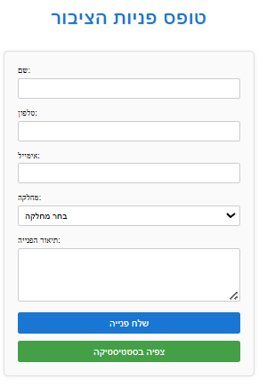
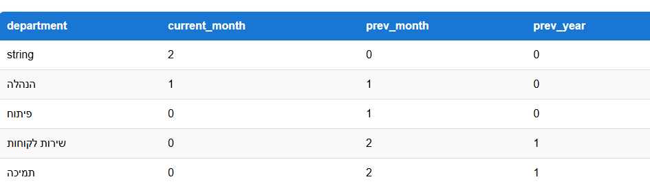

# Public Requests Management System 📬

This repository contains **two projects**:

1. **Backend** – Built in **C# / .NET**  
2. **Frontend** – Built in **Angular**

The system is designed to manage public requests efficiently, with a clean separation of concerns and easy-to-use UI.

---

## Backend (C# / .NET) 🖥️

### Architecture 🏗️

- **3-Tier Architecture**:
  1. **Presentation Layer** – Controllers handle HTTP requests and responses via Web API.
  2. **Business Logic Layer** – Services implement business rules, including calculations and comparisons.
  3. **Data Access Layer** – Repositories manage database operations using Entity Framework Core.

### Technologies 🛠️

- **Programming Language:** C#  
- **Framework:** .NET 8  
- **Database:** SQL Server 🗄️  
- **ORM:** Entity Framework Core  
- **API:** RESTful Web API 🌐  

### Database 🗃️

- **Tables:** `Request` (with `Id` column as `IDENTITY`)  
- **Stored Procedure:** `GetRequestsByDepartment` – Returns a comparison of request counts for the current month, previous month, and same month last year 📊  

### Functionality 🎯

- **CRUD Operations:** Create, Read, Update, Delete public requests ✏️📝🗑️  
- **Data Comparison:** Calls stored procedure to compare request counts 📈  
- **API Endpoints:**
  - `GET /requests` – Retrieve all requests  
  - `GET /requests/{id}` – Retrieve a request by ID  
  - `POST /requests` – Add a new request ➕  
  - `PUT /requests/{id}` – Update an existing request 🔄  
  - `DELETE /requests/{id}` – Delete a request ❌  
  - `GET /requests/summary` – Compare requests by months and year 📊  

### How to Use 🚀

1. Add your connection string to `appsettings.json`.  
2. Run the backend project using Visual Studio or .NET CLI.  
3. Test the API using Swagger or Postman 🧪.  

---

## Frontend (Angular) 🌐

### Architecture ⚛️

- **Component-Based Architecture:** UI is divided into reusable components.  
- **Services:** Handle HTTP requests to the backend API.  
- **Routing Module:** Manages navigation between views.  

### Technologies 🛠️

- **Programming Language:** TypeScript  
- **Framework:** Angular 17+  
- **HTTP Client:** Angular HttpClient for API calls  

### Functionality 🎯

- **Add/Edit/Delete Requests:** UI forms for adding requests.  
- **Summary Dashboard:** Displays comparison of requests by month and year 📊  

## 📱 Responsiveness

The project is **responsive** and adapts to different screen sizes.  
Tables, forms, and buttons adjust automatically, and horizontal scrolling is enabled on small screens.

### How to Use 🚀

1. Open the Angular project folder.  
2. Run `npm install` to install dependencies.  
3. Run `ng serve` to start the frontend on `http://localhost:4200`.  
4. The frontend communicates with the backend API for all CRUD operations and summary data.  

---

## Notes ⚠️

- Ensure the `Request` table exists in SQL Server and matches the C# model.  
- The `Id` column is `IDENTITY` – do not provide a value when creating a new request.  
- Both projects are in the same repository; the frontend communicates with the backend via API endpoints.  
- Enable CORS in the backend to allow Angular to access API from `http://localhost:4200`. 

## Demo 🖼️

